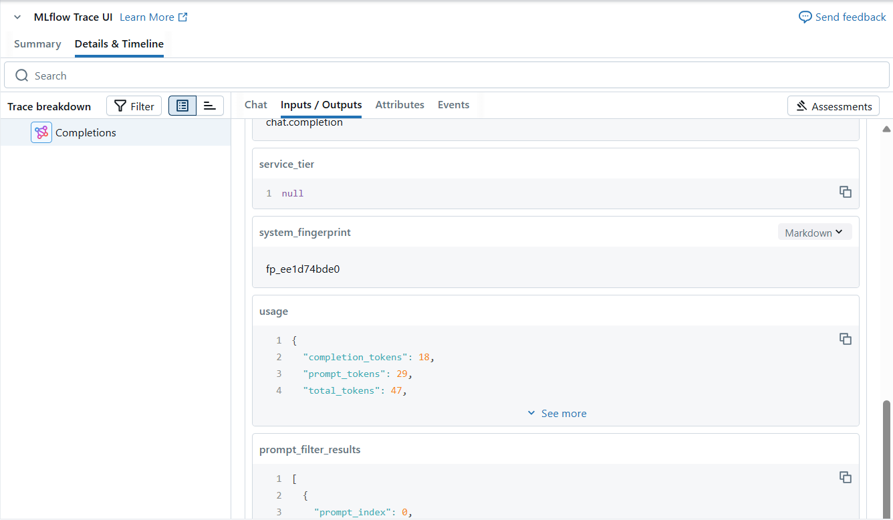

---
lab:
  title: Azure Databricks で LLMOps を実装する
---

# Azure Databricks で LLMOps を実装する

Azure Databricks は、データの準備からモデルの提供と監視まで、AI ライフサイクルを合理化し、機械学習システムのパフォーマンスと効率を最適化する統合プラットフォームを提供します。 データ ガバナンス用の Unity カタログ、モデル追跡用の MLflow、LLM をデプロイするための Mosaic AI Model Serving などの機能を利用して、生成 AI アプリケーションの開発をサポートします。

このラボは完了するまで、約 **20** 分かかります。

> **注**: Azure Databricks ユーザー インターフェイスは継続的な改善の対象となります。 この演習の手順が記述されてから、ユーザー インターフェイスが変更されている場合があります。

## 開始する前に

管理レベルのアクセス権を持つ [Azure サブスクリプション](https://azure.microsoft.com/free)が必要です。

## Azure OpenAI リソースをプロビジョニングする

まだ持っていない場合は、Azure サブスクリプションで Azure OpenAI リソースをプロビジョニングします。

1. **Azure portal** (`https://portal.azure.com`) にサインインします。
2. 次の設定で **Azure OpenAI** リソースを作成します。
    - **[サブスクリプション]**: "Azure OpenAI Service へのアクセスが承認されている Azure サブスクリプションを選びます"**
    - **[リソース グループ]**: *リソース グループを作成または選択します*
    - **[リージョン]**: *以下のいずれかのリージョンから**ランダム**に選択する*\*
        - 米国東部 2
        - 米国中北部
        - スウェーデン中部
        - スイス西部
    - **[名前]**: "*希望する一意の名前*"
    - **価格レベル**: Standard S0

> \* Azure OpenAI リソースは、リージョンのクォータによって制限されます。 一覧表示されているリージョンには、この演習で使用されるモデル タイプの既定のクォータが含まれています。 リージョンをランダムに選択することで、サブスクリプションを他のユーザーと共有しているシナリオで、1 つのリージョンがクォータ制限に達するリスクが軽減されます。 演習の後半でクォータ制限に達した場合は、別のリージョンに別のリソースを作成する必要が生じる可能性があります。

3. デプロイが完了するまで待ちます。 次に、Azure portal でデプロイされた Azure OpenAI リソースに移動します。

4. 左側のペインで、**[リソース管理]** の下の **[キーとエンドポイント]** を選択します。

5. エンドポイントと使用可能なキーの 1 つをコピーしておきます。この演習で、後でこれを使用します。

## 必要なモデルをデプロイする

Azure には、モデルのデプロイ、管理、調査に使用できる **Azure AI Foundry** という名前の Web ベース ポータルが用意されています。 Azure AI Foundry を使用してモデルをデプロイして、Azure OpenAI の調査を開始します。

> **注**:Azure AI Foundry を使用すると、実行するタスクを提案するメッセージ ボックスが表示される場合があります。 これらを閉じて、この演習の手順に従うことができます。

1. Azure portal にある Azure OpenAI リソースの **[概要]** ページで、**[開始する]** セクションまで下にスクロールし、ボタンを選択して **[Azure AI Foundry]** に移動します。
   
1. Azure AI Foundry の左ペインで、**[デプロイ]** ページを選び、既存のモデル デプロイを表示します。 まだない場合は、次の設定で **gpt-4o** モデルの新しいデプロイを作成します。
    - **デプロイ名**: *gpt-4o*
    - **デプロイの種類**:Standard
    - **モデル バージョン**: *既定のバージョンを使用する*
    - **1 分あたりのトークン数のレート制限**:10K\*
    - **コンテンツ フィルター**: 既定
    - **動的クォータを有効にする**: 無効
    
> \* この演習は、1 分あたり 10,000 トークンのレート制限内で余裕を持って完了できます。またこの制限によって、同じサブスクリプションを使用する他のユーザーのために容量を残すこともできます。

## Azure Databricks ワークスペースをプロビジョニングする

> **ヒント**: 既に Azure Databricks ワークスペースがある場合は、この手順をスキップして、既存のワークスペースを使用できます。

1. **Azure portal** (`https://portal.azure.com`) にサインインします。
2. 次の設定で **Azure Databricks** リソースを作成します。
    - **サブスクリプション**: *Azure OpenAI リソースの作成に使用したサブスクリプションと同じ Azure サブスクリプションを選択します*
    - **リソース グループ**: *Azure OpenAI リソースを作成したリソース グループと同じです*
    - **リージョン**: *Azure OpenAI リソースを作成したリージョンと同じです*
    - **[名前]**: "*希望する一意の名前*"
    - **価格レベル**: *Premium* または*試用版*

3. **[確認および作成]** を選択し、デプロイが完了するまで待ちます。 次にリソースに移動し、ワークスペースを起動します。

## ノートブックを作成する

1. Azure portal で、Azure Databricks ワークスペースが作成されたリソース グループを参照します。

1. Azure Databricks サービス リソースを選択します。

1. Azure Databricks ワークスペースの [**概要**] ページで、[**ワークスペースの起動**] ボタンを使用して、新しいブラウザー タブで Azure Databricks ワークスペースを開きます。サインインを求められた場合はサインインします。

    > **ヒント**: Databricks ワークスペース ポータルを使用すると、さまざまなヒントと通知が表示される場合があります。 これらは無視し、指示に従ってこの演習のタスクを完了してください。

1. サイド バーで **[(+) 新規]** タスクを使用して、**Notebook** を作成します。 既定のコンピューティングとして **[サーバーレス]** を選択します。

1. 最初のコード セルに次のコードを入力して実行し、必要なライブラリをインストールします。

    ```python
    %pip install openai mlflow
    dbutils.library.restartPython()
    ```
## MLflow を使用して LLM をログする

MLflow の LLM 追跡機能を使用すると、パラメーター、メトリック、予測、および成果物をログに記録できます。 パラメーターには入力構成の詳細を示すキーと値のペアが含まれるのに対して、メトリックはパフォーマンスの定量的な測定値を提供します。 予測には、入力プロンプトとモデルの応答の両方が含まれており、簡単に取得できるように成果物として格納されています。 この構造化ログは、各対話の詳細な記録を維持するのに役立ち、LLM の分析と最適化の向上を促進します。

1. 新しいセルで、この演習の冒頭でコピーしたアクセス情報を含む次のコードを実行して、Azure OpenAI リソースを使用するときに認証用の永続的な環境変数を割り当てます。

     ```python
    import os

    os.environ["AZURE_OPENAI_API_KEY"] = "your_openai_api_key"
    os.environ["AZURE_OPENAI_ENDPOINT"] = "your_openai_endpoint"
    os.environ["AZURE_OPENAI_API_VERSION"] = "2024-05-01-preview"
     ```
1. 新しいセルで、次のコードを実行して、Azure OpenAI クライアントを初期化します。

     ```python
    import os
    from openai import AzureOpenAI

    client = AzureOpenAI(
       azure_endpoint = os.getenv("AZURE_OPENAI_ENDPOINT"),
       api_key = os.getenv("AZURE_OPENAI_API_KEY"),
       api_version = os.getenv("AZURE_OPENAI_API_VERSION")
    )
     ```

1. 新しいセルで、次のコードを実行して、MLflow 追跡を初期化しモデルをログに記録します。     

     ```python
    import mlflow
    from openai import AzureOpenAI

    system_prompt = "Assistant is a large language model trained by OpenAI."

    mlflow.openai.autolog()

    with mlflow.start_run():

        response = client.chat.completions.create(
            model="gpt-4o",
            messages=[
                {"role": "system", "content": system_prompt},
                {"role": "user", "content": "Tell me a joke about animals."},
            ],
        )

        print(response.choices[0].message.content)
        mlflow.log_param("completion_tokens", response.usage.completion_tokens)
    mlflow.end_run()
     ```

上記のセルは、ワークスペースで実験を開始し、各チャット完了イテレーションのトレースを登録して、各実行の入力、出力、およびメタデータを追跡します。

## モデルを監視する

最終セルの実行後、MLflow トレース UI が自動的にセルの出力と一緒に表示されます。 左サイド バーの **[実験]** を選択してから、ノートブックの実験実行を開いて表示することもできます。

     

コマンド `mlflow.openai.autolog()` を実行すると、既定で各実行のトレースがログに記録されますが、モデルを監視するために後で使用できる `mlflow.log_param()` を使用すると、追加のパラメーターをログに記録することもできます。 モデルの監視を開始したら、さまざまな実行のトレースを比較してデータ ドリフトを検出できます。 入力データ分布、モデル予測、またはパフォーマンス メトリックの大幅な時間的変化を探します。 統計テストまたは視覚化ツールの使用も、この分析に役立ちます。

## クリーンアップ

Azure OpenAI リソースでの作業が完了したら、**Azure portal** (`https://portal.azure.com`) でデプロイまたはリソース全体を忘れずに削除します。

Azure Databricks を調べ終わったら、作成したリソースを削除できます。これにより、不要な Azure コストが生じないようになり、サブスクリプションの容量も解放されます。
