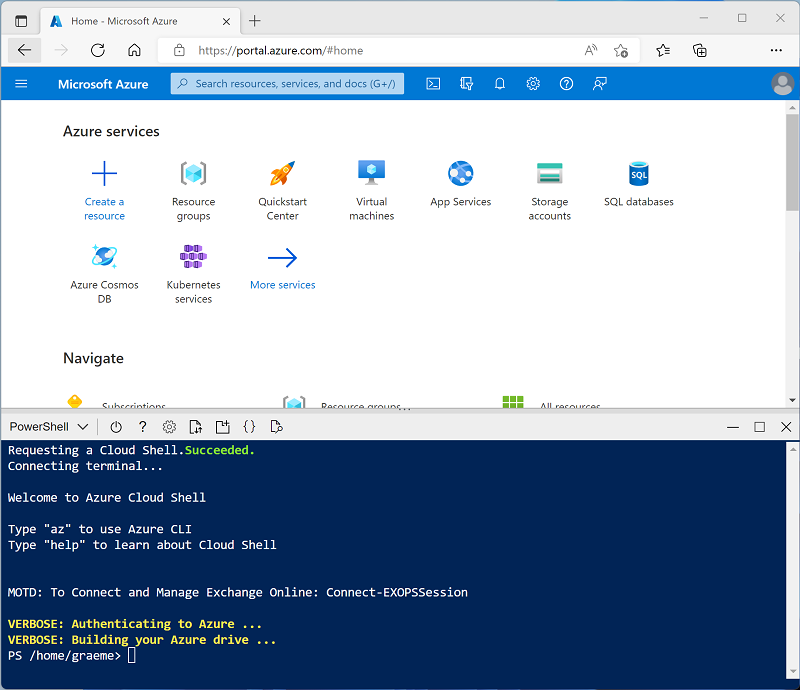

---
lab:
  title: Azure Databricks で CI/CD ワークフローを実装する
  description: コードのコミットでトリガーする自動パイプラインを作成することで、Azure Databricks と統合された GitHub Actions を使って CI/CD ワークフローを実装する実践的な経験を得ます。 データ ファイルを DBFS に自動的にデプロイするように CI パイプラインを設定し、ノートブックをインポートしてジョブとして実行するように CD パイプラインを設定する方法を学びます。GitHub リポジトリのシークレットを使って認証資格情報を安全に管理し、Databricks CLI を使ってデプロイ タスクを自動化します。
  duration: 30 minutes
  level: 400
  islab: true
  primarytopics:
    - Azure Databricks
    - Azure Portal
    - GitHub
---

# Azure Databricks で CI/CD ワークフローを実装する

GitHub Actions と Azure Databricks を使用して CI/CD ワークフローを実装すると、開発プロセスを効率化し、自動化を強化できます。 GitHub Actions は、継続的インテグレーション (CI) や継続的デリバリー (CD) など、ソフトウェア ワークフローを自動化するための強力なプラットフォームを提供します。 Azure Databricks と統合すると、これらのワークフローは、ノートブックの実行や Databricks 環境への更新のデプロイなどの複雑なデータ タスクを実行できます。 たとえば、GitHub Actions を使用して、Databricks ノートブックのデプロイを自動化したり、Databricks ファイル システムのアップロードを管理したり、ワークフロー内で Databricks CLI を設定したりできます。 この統合により、特にデータドリブン アプリケーションの場合、より効率的でエラーに強い開発サイクルが容易になります。

このラボは完了するまで、約 **30** 分かかります。

> **注**: Azure Databricks ユーザー インターフェイスは継続的な改善の対象となります。 この演習の手順が記述されてから、ユーザー インターフェイスが変更されている場合があります。

> **注:** この演習を完了するには、GitHub アカウントと、お使いのローカル コンピューターにインストールされた Git クライアント (Git コマンド ライン ツールなど) が必要です。

## Azure Databricks ワークスペースをプロビジョニングする

> **ヒント**: 既に Azure Databricks ワークスペースがある場合は、この手順をスキップして、既存のワークスペースを使用できます。

この演習には、新しい Azure Databricks ワークスペースをプロビジョニングするスクリプトが含まれています。 このスクリプトは、この演習で必要なコンピューティング コアに対する十分なクォータが Azure サブスクリプションにあるリージョンに、*Premium* レベルの Azure Databricks ワークスペース リソースを作成しようとします。また、使用するユーザー アカウントのサブスクリプションに、Azure Databricks ワークスペース リソースを作成するための十分なアクセス許可があることを前提としています。 十分なクォータやアクセス許可がないためにスクリプトが失敗した場合は、[Azure portal で、Azure Databricks ワークスペースを対話形式で作成](https://learn.microsoft.com/azure/databricks/getting-started/#--create-an-azure-databricks-workspace)してみてください。

1. Web ブラウザーで、`https://portal.azure.com` の [Azure portal](https://portal.azure.com) にサインインします。
2. ページ上部の検索バーの右側にある **[\>_]** ボタンを使用して、Azure portal に新しい Cloud Shell を作成します。***PowerShell*** 環境を選択します。 次に示すように、Azure portal の下部にあるペインに、Cloud Shell のコマンド ライン インターフェイスが表示されます。

    

    > **注**: *Bash* 環境を使用するクラウド シェルを以前に作成した場合は、それを ***PowerShell*** に切り替えます。

3. ペインの上部にある区分線をドラッグして Cloud Shell のサイズを変更したり、ペインの右上にある **&#8212;** 、 **&#10530;** 、**X** アイコンを使用して、ペインを最小化または最大化したり、閉じたりすることができます。 Azure Cloud Shell の使い方について詳しくは、[Azure Cloud Shell のドキュメント](https://docs.microsoft.com/azure/cloud-shell/overview)をご覧ください。

4. PowerShell のペインで、次のコマンドを入力して、リポジトリを複製します。

     ```powershell
    rm -r mslearn-databricks -f
    git clone https://github.com/MicrosoftLearning/mslearn-databricks
     ```

5. リポジトリをクローンした後、次のコマンドを入力して **setup.ps1** スクリプトを実行します。これにより、使用可能なリージョンに Azure Databricks ワークスペースがプロビジョニングされます。

     ```powershell
    ./mslearn-databricks/setup.ps1
     ```

6. メッセージが表示された場合は、使用するサブスクリプションを選択します (これは、複数の Azure サブスクリプションへのアクセス権を持っている場合にのみ行います)。

7. スクリプトの完了まで待ちます。通常、約 5 分かかりますが、さらに時間がかかる場合もあります。 待っている間に、Azure Databricks ドキュメントの記事「[Databricks アセット バンドルと GitHub Actions を使用して CI/CD ワークフローを実行する](https://learn.microsoft.com/azure/databricks/dev-tools/bundles/ci-cd-bundles)」を確認してください。

## クラスターの作成

Azure Databricks は、Apache Spark "クラスター" を使用して複数のノードでデータを並列に処理する分散処理プラットフォームです。** 各クラスターは、作業を調整するドライバー ノードと、処理タスクを実行するワーカー ノードで構成されています。 この演習では、ラボ環境で使用されるコンピューティング リソース (リソースが制約される場合がある) を最小限に抑えるために、*単一ノード* クラスターを作成します。 運用環境では、通常、複数のワーカー ノードを含むクラスターを作成します。

> **ヒント**: Azure Databricks ワークスペースに 13.3 LTS 以降のランタイム バージョンを持つクラスターが既にある場合は、それを使ってこの演習を完了し、この手順をスキップできます。

1. Azure portal で、スクリプトによって作成された **msl-*xxxxxxx*** リソース グループ (または既存の Azure Databricks ワークスペースを含むリソース グループ) に移動します

1. Azure Databricks Service リソース (セットアップ スクリプトを使って作成した場合は、**databricks-*xxxxxxx*** という名前) を選択します。

1. Azure Databricks ワークスペースの [**概要**] ページで、[**ワークスペースの起動**] ボタンを使用して、新しいブラウザー タブで Azure Databricks ワークスペースを開きます。サインインを求められた場合はサインインします。

    > **ヒント**: Databricks ワークスペース ポータルを使用すると、さまざまなヒントと通知が表示される場合があります。 これらは無視し、指示に従ってこの演習のタスクを完了してください。

1. 左側のサイドバーで、**[(+) 新規]** タスクを選択し、**[クラスター]** を選択します (**[その他]** サブメニューを確認する必要がある場合があります)。

1. **[新しいクラスター]** ページで、次の設定を使用して新しいクラスターを作成します。
    - **クラスター名**: "ユーザー名の" クラスター (既定のクラスター名)**
    - **ポリシー**:Unrestricted
    - **クラスター モード**: 単一ノード
    - **アクセス モード**: 単一ユーザー (*自分のユーザー アカウントを選択*)
    - **Databricks Runtime のバージョン**: 13.3 LTS (Spark 3.4.1、Scala 2.12) 以降
    - **Photon Acceleration を使用する**: 選択済み
    - **ノード タイプ**: Standard_D4ds_v5
    - **非アクティブ状態が ** *20* ** 分間続いた後終了する**

1. クラスターが作成されるまで待ちます。 これには 1、2 分かかることがあります。

    > **注**: クラスターの起動に失敗した場合、Azure Databricks ワークスペースがプロビジョニングされているリージョンでサブスクリプションのクォータが不足していることがあります。 詳細については、「[CPU コアの制限によってクラスターを作成できない](https://docs.microsoft.com/azure/databricks/kb/clusters/azure-core-limit)」を参照してください。 その場合は、ワークスペースを削除し、別のリージョンに新しいワークスペースを作成してみてください。 次のように、セットアップ スクリプトのパラメーターとしてリージョンを指定できます: `./mslearn-databricks/setup.ps1 eastus`
   
## GitHub リポジトリを設定する

GitHub リポジトリを Azure Databricks ワークスペースに接続したら、リポジトリに加えられた変更をトリガーする GitHub Actions の CI/CD パイプラインを設定できます。

1. [GitHub アカウント](https://github.com/)に移動し、適切な名前 (*databricks-cicd-repo* など) の新しいプライベート リポジトリを作成します。

1. [git clone](https://git-scm.com/docs/git-clone) コマンドを使用して、空のリポジトリをローカル コンピューターにクローンします。

1. この演習に必要なファイルをリポジトリのローカル フォルダーにダウンロードします。
   - [CSV ファイル](https://github.com/MicrosoftLearning/mslearn-databricks/raw/main/data/sample_sales.csv)
   - [Databricks Notebook](https://github.com/MicrosoftLearning/mslearn-databricks/raw/main/data/sample_sales_notebook.py)
   - [[ジョブ構成ファイル]](https://github.com/MicrosoftLearning/mslearn-databricks/raw/main/data/job-config.json)

1. Git リポジトリのローカル クローンに、ファイルを[追加](https://git-scm.com/docs/git-add)します。 次に、変更を[コミット](https://git-scm.com/docs/git-commit)し、それらをリポジトリに[プッシュ](https://git-scm.com/docs/git-push)します。

## リポジトリ シークレットを設定する

シークレットは、組織、リポジトリ、またはリポジトリ環境内に作成する変数です。 作成したシークレットは、GitHub Actions のワークフローで使用できます。 ワークフローにシークレットを明示的に含めた場合にのみ、GitHub Actions でシークレットを読み取ることができます。

GitHub Actions ワークフローは Azure Databricks からリソースにアクセスする必要がある場合、認証資格情報は、CI/CD パイプラインで使用される暗号化された変数として格納されます。

リポジトリ シークレットを作成する前に、Azure Databricks で個人用アクセス トークンを生成する必要があります。

1. Azure Databricks ワークスペースで、上部バーの*ユーザー* アイコンを選択し、次にドロップダウンから **[設定]** を選択します。

1. **[開発者]** ページで、**[アクセス トークン]** の横にある **[管理]** を選択します。

1. **[新しいトークンの生成]** を選択し、**[生成]** を選択します。

1. 表示されたトークンをコピーし、後で参照できるように、どこかに貼り付けます。 **[完了]** を選択します。

1. GitHub リポジトリ ページで、**[設定]** タブを選択します。

   ![[GitHub の設定] タブ](./images/github-settings.png)

1. 左側のサイドバーで、**[シークレットと変数]** を選択し、**[アクション]** を選択します。

1. **[新しいリポジトリ シークレット]** を選択し次の各変数を追加します。
   - **名前:** DATABRICKS_HOST **シークレット:** Databricks ワークスペースの URL を追加します。
   - **名前:** DATABRICKS_TOKEN **シークレット:** 以前に生成されたアクセス トークンを追加します。

## CI パイプラインの設定

GitHub から Azure Databricks ワークスペースにアクセスするために必要な認証情報を格納したので、データインジェストへのワークフローを作成します。 リポジトリのメイン ブランチでコミットがプッシュされるか、プル要求がマージされるたびにデプロイされます。 このワークフローにより、Azure Databricks ワークスペースで使用されるデータ ソースが常に最新の状態になります。

1. リポジトリ ページで **[アクション]** タブを選択します。

    ![[GitHub Actions] タブ](./images/github-actions.png)

1. [**自分でワークフローを設定する]** を選択し、次のコードを入力します。

     ```yaml
    name: CI Pipeline for Azure Databricks

    on:
      push:
        branches:
          - main
      pull_request:
        branches:
          - main

    jobs:
      deploy:
        runs-on: ubuntu-latest

        steps:
        - name: Checkout code
          uses: actions/checkout@v3

        - name: Set up Python
          uses: actions/setup-python@v4
          with:
            python-version: '3.x'

        - name: Install Databricks CLI
          run: |
            pip install databricks-cli

        - name: Configure Databricks CLI
          run: |
            databricks configure --token <<EOF
            ${{ secrets.DATABRICKS_HOST }}
            ${{ secrets.DATABRICKS_TOKEN }}
            EOF

        - name: Upload sample data to DBFS
          run: databricks fs cp sample_sales.csv dbfs:/FileStore/sample_sales.csv --overwrite
     ```

    上記のコードでは、Databricks CLI をインストールして構成し、リポジトリからワークスペースにサンプル データをコピーします。

1. ワークフロー **CI_pipeline.yml** に名前を付け、**[変更のコミット]** を選択します。 パイプラインは自動的に実行され、**[アクション]** タブでその状態を確認できます。

1. ワークフローが完了したら、ワークスペース ページに移動し、**[+ 新規]** を選択して新しいノートブックを作成します。
  
1. 最初のコード セルで、次のコードを実行します。

     ```python
    %fs
    ls FileStore
     ``` 

    出力で、サンプル データが Databricks ファイル システムに存在し、ワークスペースで使用できるようになったことを確認できます。

## CD パイプラインの設定

データ インジェストを自動化するように CI ワークフローを設定した後、データ処理を自動化する 2 つ目のワークフローを作成します。 CD ワークフローは、Azure Databricks ワークスペースの **[ジョブ実行]** ページに登録された出力を使用して、ジョブ実行としてノートブックを実行します。 ノートブックには、データが使用される前に必要なすべての変換手順が含まれています。

1. [ワークスペース] ページに移動し、**[コンピューティング]** を選択し、クラスターを選択します。

1. クラスターのページで、**[終了する]** ボタンの左側にあるオプションを開き、**[JSON の表示]** を選択します。 ワークフローでジョブ実行を設定するために必要なクラスターの ID をコピーします。

1. リポジトリ内の **job-config.json** を開き、*your_cluster_id* を、先ほどコピーしたクラスター ID に置き換えます。 また、*/Workspace/Users/your_username/your_notebook* を、パイプラインで使用されるノートブックを格納するワークスペース内のパスに置き換えます。 変更をコミットします。

    > **注:****[アクション]** タブに移動すると、CI パイプラインが再び実行され始めたことがわかります。 コミットがプッシュされるたびにトリガーされることになっているので、*job-config.json* を変更すると、想定どおりにパイプラインがデプロイされます。

1. **[アクション]** タブで **CD_pipeline.yml** という名前の新しいワークフローを作成し、次のコードを入力します。

     ```yaml
    name: CD Pipeline for Azure Databricks

    on:
      push:
        branches:
          - main

    jobs:
      deploy:
        runs-on: ubuntu-latest

        steps:
        - name: Checkout code
          uses: actions/checkout@v3

        - name: Set up Python
          uses: actions/setup-python@v4
          with:
            python-version: '3.x'

        - name: Install Databricks CLI
          run: pip install databricks-cli

        - name: Configure Databricks CLI
          run: |
            databricks configure --token <<EOF
            ${{ secrets.DATABRICKS_HOST }}
            ${{ secrets.DATABRICKS_TOKEN }}
            EOF
     
        - name: Import Notebook to Workspace
          run: databricks workspace import sample_sales_notebook.py /Workspace/Users/your_username/your_notebook -l python --overwrite

          env:
            DATABRICKS_TOKEN: ${{ secrets.DATABRICKS_TOKEN }}

        - name: Run Databricks Job
          run: |
            databricks jobs create --json-file job-config.json
            databricks jobs run-now --job-id $(databricks jobs list | grep -m 1 'CD pipeline' | awk '{print $1}')
          env:
            DATABRICKS_TOKEN: ${{ secrets.DATABRICKS_TOKEN }}
     ```

    変更をコミットする前に、`/Workspace/Users/your_username/your_notebook` を、Azure Databricks ワークスペースでノートブックをインポートしたいファイル パスに置き換えます。

1. 変更をコミットします。

    このコードでは、Databricks CLI を再度インストールして構成し、ノートブックをワークスペースにインポートし、それを実行するジョブ実行を作成します。 ジョブ実行の進行状況は、ワークスペースの **[ワークフロー]** ページで監視できます。 出力を確認し、データ サンプルがデータフレームに読み込まれ、詳細に分析できるように変更されていることを確認します。

## クリーンアップ

Azure Databricks ポータルの **[コンピューティング]** ページでクラスターを選択し、**[&#9632; 終了]** を選択してクラスターをシャットダウンします。

Azure Databricks を調べ終わったら、作成したリソースを削除できます。これにより、不要な Azure コストが生じないようになり、サブスクリプションの容量も解放されます。
