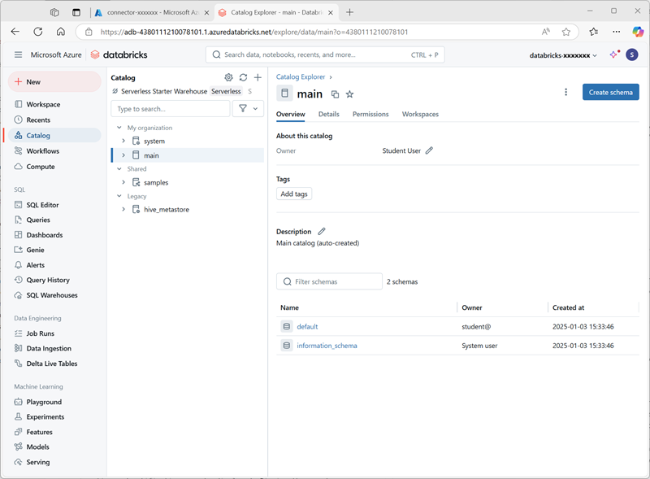
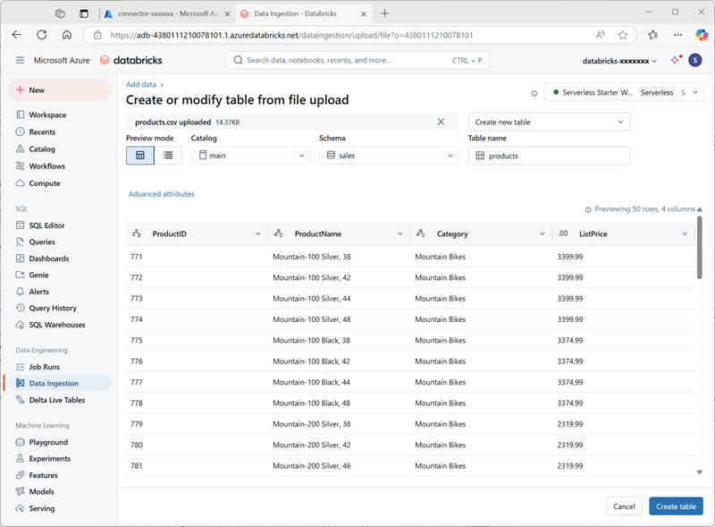
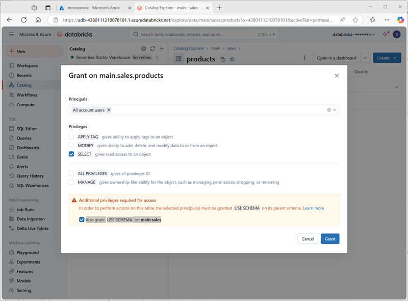
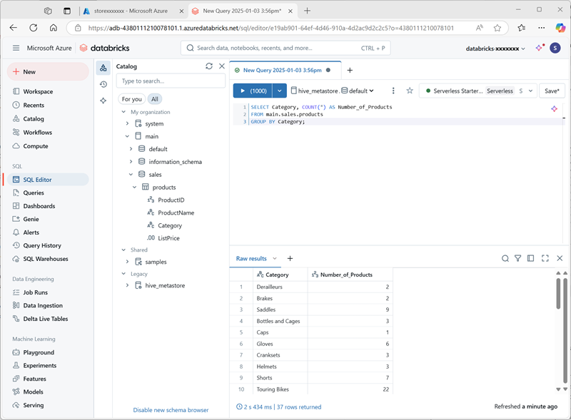
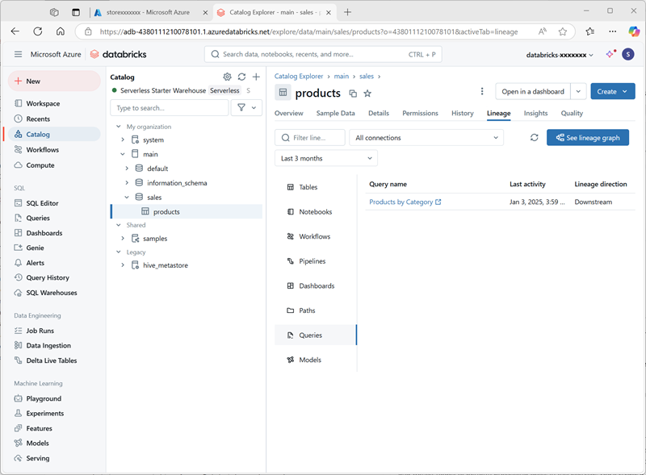

---
lab:
  title: Azure Databricks の Unity Catalog について調べる
  description: Azure Data Lake Storage Gen2 とアクセス コネクタを介したマネージド ID アクセスを使って、外部メタストア ストレージを構成することにより、Unity Catalog での一元的なデータ ガバナンスの実装を実践的に経験します。 きめ細かなアクセス許可管理を使ってカタログ、スキーマ、テーブルを作成してデータ アクセスを制御する方法、およびクエリと変換が監査とガバナンスのためにソース データにどのように接続するかをデータ系列の追跡を使って理解する方法を学びます。
  duration: 45 minutes
  level: 300
  islab: true
  primarytopics:
    - Azure Databricks
    - Azure Portal
---

# Azure Databricks の Unity Catalog について調べる

Unity Catalog は、データ アクセスの管理や監査を行う一元的な場所を提供してセキュリティを簡素化することによって、データと AI の一元的なガバナンス ソリューションを実現します。 この演習では、Azure Databricks ワークスペースの Unity Catalog を構成し、それを使用してデータを管理します。

> **注**: 場合によっては、Unity Catalog がワークスペースですでに有効になっている可能性があります。 この演習の手順に従って、カタログに新しいストレージ アカウントを割り当てることができます。

このラボは完了するまで、約 **45** 分かかります。

> **注**: Azure Databricks ユーザー インターフェイスは継続的な改善の対象となります。 この演習の手順が記述されてから、ユーザー インターフェイスが変更されている場合があります。

## 開始する前に

<u>グローバル管理者</u>のアクセス権を持つ [Azure サブスクリプション](https://azure.microsoft.com/free)が必要です。

> **重要**: この演習では、Azure サブスクリプションで*グローバル管理者*のアクセス権があることを前提としています。 このレベルのアクセス権は、Azure Databricks ワークスペースで Unity Catalog を有効にするために Databricks アカウントを管理する際に必要です。

## Azure Databricks ワークスペースを作成する

> **ヒント**: Premium レベルの Azure Databricks ワークスペースが既にある場合は、この手順をスキップして、既存のワークスペースを使用できます。

1. **Azure portal** (`https://portal.azure.com`) にサインインします。
2. 次の設定で **Azure Databricks** リソースを作成します。
    - **[サブスクリプション]**: *Azure サブスクリプションを選択します*
    - **リソース グループ**: *`msl-xxxxxxx` という名前の新しいリソース グループを作成します ("xxxxxxx" は一意の値です)*
    - **ワークスペース名**: `databricks-xxxxxxx`*("xxxxxxx" はリソース グループ名で使用される値です)*
    - **リージョン**: *使用可能なリージョンを選択します*
    - **価格レベル**: *Premium* または*試用版*
    - **管理対象リソース グループ名**: `databricks-xxxxxxx-managed`*("xxxxxxx" はリソース グループ名で使用される値です)*

    ![Azure portal の [Azure Databricks ワークスペースを作成する] ページのスクリーンショット](./images/create-databricks.png)

3. **[確認および作成]** を選択し、デプロイが完了するまで待ちます。

## カタログ向けのストレージを準備する

Azure Databricks で Unity Catalog を使用する場合、データは外部ストアに格納され、複数のワークスペース間で共有できます。 Azure では、この目的で Azure Data Lake Storage Gen2 階層型名前空間をサポートする Azure Storage アカウントを使用するのが一般的です。

1. Azure portal で、次の設定を使用して新しい**ストレージ アカウント**を作成します。
    - **[基本]** :
        - **[サブスクリプション]**: *Azure サブスクリプションを選択します*
        - **リソース グループ**: *Azure Databricks ワークスペースを作成した既存の **msl-xxxxxxx** リソース グループを選択します。*
        - **ストレージ アカウント名**: `storexxxxxxx`*("xxxxxxx" はリソース グループ名で使用される値です)*
        - **リージョン**: *<u>Azure Databricks ワークスペースを作成したリージョン</u>を選択します*
        - **プライマリ サービス**: Azure Blob Storage または Azure Data Lake Storage Gen 2
        - **パフォーマンス**: 標準
        - **冗長**: ローカル冗長ストレージ (LRS) *(この演習のような非運用ソリューションの場合、このオプションのコストと容量消費の利点は低くなります)*
    - **詳細**:
        - **階層型名前空間を有効にする**: *選択されています*
    
    ![Azure potal の [ストレージ アカウントの作成] の詳細設定ページのスクリーンショット。](./images/create-storage.png)

1. **[確認および作成]** を選択し、デプロイが完了するまで待ちます。
1. デプロイが完了したら、デプロイされた *storexxxxxxx* ストレージ アカウント リソースに移動し、**ストレージ ブラウザー** ページを使用して、`data` という名前の新しい BLOB コンテナーを追加します。 ここに、Unity Catalog オブジェクトのデータが格納されます。

    ![Azure portal の [ストレージ ブラウザー] ページの [コンテナーを作成する] ペインのスクリーンショット。](./images/create-container.png)

## カタログ ストレージへのアクセスを構成する

Unity Catalog 用に作成した BLOB コンテナーにアクセスするには、Azure Databricks ワークスペースでマネージド アカウントを使用して、*アクセス コネクタ*経由でストレージ アカウントに接続する必要があります。

1. Azure portal で、次の設定を使用して新しい **Azure Databricks のアクセス コネクタ**リソースを作成します。
    - **[サブスクリプション]**: *Azure サブスクリプションを選択します*
    - **リソース グループ**: *Azure Databricks ワークスペースを作成した既存の **msl-xxxxxxx** リソース グループを選択します。*
    - **名前**: `connector-xxxxxxx`*("xxxxxxx" はリソース グループ名で使用される値です)*
    - **リージョン**: *<u>Azure Databricks ワークスペースを作成したリージョン</u>を選択します*

    ![Azure portal の [Azure Databricks のアクセス コネクタを作成する] ページのスクリーンショット。](./images/create-connector.png)

1. **[確認および作成]** を選択し、デプロイが完了するまで待ちます。 次に、デプロイされたリソースに移動し、**概要**ページで、**リソース ID** を書き留めます。これは、*/subscriptions/abc-123.../resourceGroups/msl-xxxxxxx/providers/Microsoft.Databricks/accessConnectors/connector-xxxxxxx* の形式にする必要があります。
1. Azure portal で、*storexxxxxxx* ストレージ アカウント リソースに戻り、**[Access Control (IAM)]** ページで新しいロールの割り当てを追加します。
1. **[職務のロール]** 一覧で、`Storage blob data contributor` ロールを検索して選択します。

    ![Azure portal の [ロールの割り当てを追加] ページのスクリーンショット。](./images/role-assignment-search.png)

1. [**次へ**] を選択します。 次に、**[メンバー]** ページで、**マネージド ID** にアクセスを割り当てるオプションを選択し、先に作成した Azure Databricks の `connector-xxxxxxx` アクセス コネクタを見つけて選択します (サブスクリプションで作成された他のアクセス コネクタは無視します)。

    ![Azure portal の [マネージド ID の選択] ペインのスクリーンショット。](./images/managed-identity.png)

1. ロール メンバーシップを確認して割り当てて、Azure Databricks の *connector-xxxxxxx* アクセス コネクタのマネージド ID を、*storexxxxxxx* ストレージ アカウントのストレージ BLOB データ共同作成者ロールに追加します。これにより、ストレージ アカウント内のデータにアクセスできるようになります。

## Unity Catalog の構成

カタログ用の BLOB Storage コンテナーを作成し、Azure Databricks マネージド ID がアクセスする方法を提供できたので、ストレージ アカウントに基づいてメタストアを使用するように Unity Catalog を構成できます。

1. Azure portal で、**msl-*xxxxxxx*** リソース グループを表示します。これで、次の 3 つのリソースが含まれるようになります。
    - **databricks-*xxxxxxx*** Azure Databricks ワークスペース
    - **store*xxxxxxx*** ストレージ アカウント
    - **connector-*xxxxxxx*** Azure Databricks 用のアクセス コネクタ

1. 前に作成した **databricks-xxxxxxx** Azure Databricks ワークスペース リソースを開き、**[概要]** ページで、**[ワークスペースの起動]** ボタンを使用して、新しいブラウザー タブで Azure Databricks ワークスペースを開きます。求められた場合はサインインします。
1. 右上にある **databricks-*xxxxxxx*** メニューで、**[アカウントの管理]** を選択し、別のタブで Azure Databricks アカウント コンソールを開きます。

    ![Azure Databricks ワークスペースの [アカウントの管理] メニュー項目のスクリーンショット。](./images/manage-account-menu.png)

    > **注**: ***[アカウントの管理]*** が一覧にない場合、または正常に開かない場合は、グローバル管理者に Azure Databricks ワークスペースの ***アカウント管理者***ロールにアカウントを追加してもらう必要があります。
    >
    > 個人用の Microsoft アカウント (oultook.com アカウントなど) を使用して作成した個人用 Azure サブスクリプションを使用している場合は、Azure ディレクトリに「外部」の Entra ID アカウントが自動的に作成されている可能性があり、そのアカウント名を使用してサインインする必要がある場合があります。
    >
    > ヘルプが必要な場合は、***[この Q & A のスレッド](https://learn.microsoft.com/answers/questions/2133569/not-able-to-access-databricks-manage-account-conso)*** を参照してください。

1. Azure Databricks アカウント コンソールの、**[カタログ]** ページで、**[メタストアの作成]** を選択します。
1. 次の設定を使用して新しいメタストアを作成します。
    - **名前**: `metastore-xxxxxxx`*(xxxxxxx は、この演習でリソースに使用してきた一意の値です)*
    - **リージョン**: *Azure リソースを作成したリージョンを選択します*
    - **ADLS Gen 2 パス**: `data@storexxxxxxx.dfs.core.windows.net/`*(storexxxxxx はストレージ アカウント名です)*
    - **Access Connector ID**: *アクセス コネクタのリソース ID (Azure portal の [概要] ページからコピー)*

    ![Azure Databricks アカウント コンソールの [メタストアの作成] ページのスクリーンショット。](./images/create-metastore.png)

1. メタストアを作成したら、**databricks-*xxxxxxx*** ワークスペースを選択し、メタストアを割り当てます。

    ![Azure Databricks アカウント コンソールの [メタストアの作成] ページのスクリーンショット。](./images/assign-metastore.png)

## Unity Catalog でデータを操作する

永続的なメタストアを割り当てて Unity Catalog を有効にしたので、それを使用して Azure Databricks のデータを操作できます。

### テーブルを作成して読み込む

1. Azure Databricks アカウント コンソールのブラウザー タブを閉じ、Azure Databricks ワークスペースのタブに戻ります。 その後、<u>ブラウザーを更新</u>します。
1. **カタログ** ページで、組織の **メイン** カタログを選択し、**default** および **Information_schema** という名前のスキーマが既にカタログに作成されていることを確認します。

    

1. **[スキーマの作成]** を選択し、`sales` という名前の新しいスキーマを作成します (カタログの既定のメタストアが使用されるように、保存場所は指定しないでおきます)。
1. [**products.csv**](https://raw.githubusercontent.com/MicrosoftLearning/mslearn-databricks/main/data/products.csv) ファイルを `https://raw.githubusercontent.com/MicrosoftLearning/mslearn-databricks/main/data/products.csv` からローカル コンピューターにダウンロードし、**products.csv** として保存します。
1. Azure Databricks ワークスペースのカタログ エクスプローラーで、**sales** スキーマが選択されている状態で、**[作成]** > **[テーブルの作成]** の順に選択します。 次に、ダウンロードした **products.csv** ファイルをアップロードして、**sales** スキーマに **products** という名前の新しいテーブルを作成します。

    > **注**: サーバーレス コンピューティングが開始されるまで数分かかる場合があります。

    

1.  テーブルを作成します。 AI によって生成された説明が推奨される場合は、それを受け入れます。

### アクセス許可の管理

1. **products** テーブルを選択した状態で、**[アクセス許可]** タブで、新しいテーブルに対するアクセス許可が既定で割り当てられていないことを確認します (完全な管理者権限を持っているのでアクセスできますが、他のユーザーはテーブルでクエリを実行できません)。
1. **[許可]** を選択し、次のようにテーブルへのアクセスを構成します。
    - **プリンシパル**: すべてのアカウント ユーザー
    - **特権**: 選択
    - **アクセスに必要な追加の特権**: main.sales に USE SCHEMA も付与します

    

### 系列をトラッキングする

1. **[+ 新規]** メニューで **[クエリ]** を選択し、次の SQL コードを使用して新しいクエリを作成します。

    ```sql
    SELECT Category, COUNT(*) AS Number_of_Products
    FROM main.sales.products
    GROUP BY Category; 
    ```

1. サーバーレス コンピューティングが接続されていることを確認し、クエリを実行して結果を確認します。

    

1. クエリを `Products by Category` として、Azure Databricks ユーザー アカウントのワークスペース フォルダーに保存します。
1. **[カタログ]** ページに戻ります。 次に、**main** カタログと **sales** スキーマを展開し、**products** テーブルを選択します。
1. **[系列]** タブで **[クエリ]** を選択して、作成したクエリからソース テーブルへの系列が Unity Catalog によって追跡されていることを確認します。

    

## クリーンアップ

この演習では、Azure Databricks ワークスペースの Unity Catalog を有効にして構成し、それを使用してメタストア内のデータを操作しました。 Azure Databricks の Unity Catalog でできることについて詳しくは、「[ Unity Catalog を使用したデータ ガバナンス](https://learn.microsoft.com/azure/databricks/data-governance/)」を参照してください。

Azure Databricks を調べ終わったら、作成したリソースを削除できます。これにより、不要な Azure コストが生じないようになり、サブスクリプションの容量も解放されます。
